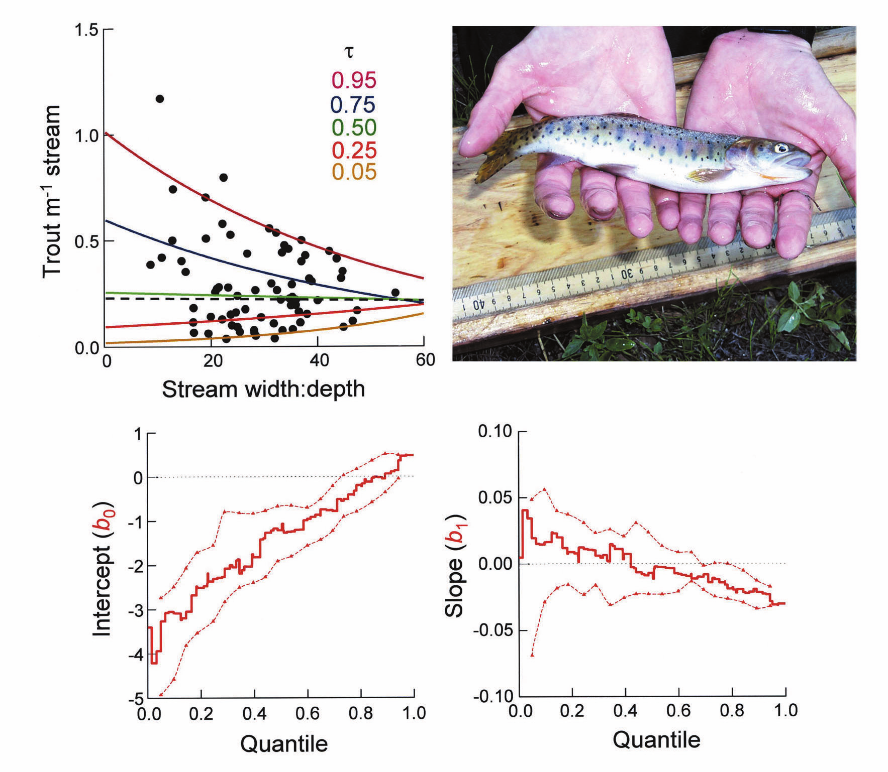
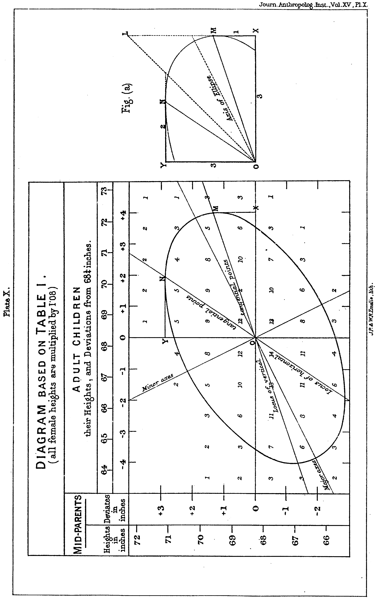
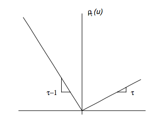

```{r setup, include=FALSE}
knitr::opts_chunk$set(echo = FALSE, cache = FALSE, message=FALSE, warning = FALSE, 
                      fig.ext='png', fig.align='center', fig.path = "images/",
                      fig.pos = "H", dev = "png", dpi = 600, out.width = "70%")
type <- knitr::opts_knit$get("rmarkdown.pandoc.to")
options(digits = 10)
library(quantreg)
library(appraiseR)
library(ggplot2)
library(ggthemes)
theme_set(theme_stata())
library(stargazer)
library(mosaic)
library(LaplacesDemon)
```

# Resumo {-}

A NBR 14.653-02 recomenda que, na Engenharia de Avaliações de imóveis urbanos, 
para o tratamento dos dados, seja utilizada metodologia científica, mesmo no
tratamento de dados por fatores, o que usualmente é feito através do método da
regressão linear, ainda que a norma também cite outros métodos, como a regressão 
espacial, a  análise envoltória de dados e as redes neurais artificiais.
No entanto, através destes métodos, o que se obtém são coeficientes ou fatores 
**médios** da contribuição de uma característica do imóvel na formação do valor 
final. Ocorre que a contribuição de uma determinada característica para a formação
do valor final dos imóveis pode ser diferente para os diferentes quantis da 
distribuição de probabilidades. É possível até que uma determinada característica 
que se mostre insignificante no método da regressão linear seja significativa na 
regressão quantílica, já que na regressão linear o que se estima é se, **em média**,
uma determinada característica tem influência na formação do valor total de um 
imóvel. Ocorre que uma determinada característica pode influenciar positivamente
o preço de venda dos imóveis de maior valor e negativamente o preço de venda dos 
imóveis de menor valor (ou *vice versa*), sendo que, **em média**, o seu efeito 
seja nulo, o que no entanto não quer dizer que aquela variável não tenha qualquer 
influência na formação de preço dos imóveis do mercado em análise. Em suma, esta 
diferente contribuição das características no valor final dos imóveis, atualmente, 
é ignorada, sendo apenas utilizado o valor médio, sendo que diferentes efeitos das 
características em imóveis de valores diferentes são negligenciadas. A regressão 
quantílica é um método que permite estimar a real influência de cada 
característica ao longo de toda a distribuição de probabilidades dos imóveis de 
um mercado, o que pode se demonstrar útil na avaliação de imóveis urbanos em
determinados mercados o que atualmente pode passar despercebido aos olhos do 
avaliador acostumado com os métodos estatísticos clássicos.

# Introdução

@Zietz mostra que os conflitos a respeito da contribuição de uma determinada 
característica na formação dos preços de venda de imóveis residenciais podem ser 
esclarecidos através da regressão quantílica. Diferentes valores para os 
coeficientes de regressão linear para algumas características podem ser encontrados 
ao longo da distribuição de preços de venda de imóveis. Ou seja, algumas 
características dos imóveis residenciais podem ser mais valorizados por compradores 
de imóveis de mais alto valor do que por compradores de imóveis de menor valor.

Segundo @Zietz, variáveis como área construída, área do lote e número de
banheiros tem um impacto maior nos imóveis de maior valor de venda, enquanto outras
variáveis parecem ter um comportamento constante para todos os preços de venda
de imóveis, como garagens e distância ao centro, entre outras.

A regressão quantílica permite que a influência de uma característica qualquer de
um imóvel tenha efeitos diferentes para diferentes faixas de valores de imóveis.

@QReco mostra...

```{r trutas, fig.cap="Mudanças na densidade de trutas ($y$) em função do quociente da largura sobre altura de um canal ($X$). Fonte: [@QReco].", out.width="100%"}

```


# Regressão Quantílica


## Breve Histórico

@stigler1986

Segundo Koenker [-@mim, 371], o gráfico mais importante da história da estatística
é o gráfico de Galton, por nós reproduzido na figura 1.

O gráfico ilustra o fenômeno, descoberto por Galton, da regressão à média, cuja
importância até hoje se faz presente em diversos estudos científicos, que 
estabelecem grupos de controle e tratamento para isolar os efeitos do 
tratamento pesquisado do efeito do fenômeno da regressão à média (ou reversão
à média).



Segundo Koenker [-@koenker2000], a característica essencial da regressão linear
clássica, derivada deste gráfico, é que o efeito do covariante na variável 
resposta é inteiramente capturado pela seguinte expressão:

$$\mathbb{E}(Y|X = x) = x'\beta$$
enquanto a aleatoriedade remanescente de $Y$ dado $X$ é modela por um termo de 
erro aditivo independente de $X$.

Boscovich propôs em 1760 [@tortoise, 281] -- portanto ainda antes da introdução 
do método dos mínimos quadrados por Legendre  em 1805[^1], no seu trabalho 
intitulado  *Nouvelles méthodes pour la determination des orbites des comètes* --, 
o seguinte problema:

Encontrar $\hat \alpha$ e $\hat \beta$ tais que:

$$y_i = \hat \alpha + \hat \beta x_i + \hat u_i$$

com $\sum \hat u_i = 0$ e $\sum |\hat u_i| = \text{min!}$.

Laplace resolveu o problema matematicamente em 1789 [@tortoise, 281]. 

Posteriormente, com a chegada do *méthode des moindres carrés*, ou seja, do método 
dos mínimos quadrados ordinários, o método dos mínimos erros absolutos de Laplace 
ficou em segundo plano, até que Edgeworth, em 1887 propõe o primeiro algoritmo capaz de obter o intercepto e o coeficiente angular da reta do método 
dos mínimos desvios absolutos, relaxando a restrição de que a soma dos resíduos 
seja igual a zero ($\sum \hat u_i = 0$)  [@tortoise, 281].

Na década de 40 surgiram os primeiros algoritmos simplex destinados à otimização, 
algoritmos estes que se ajustam às necessidades do métodos dos mínimos desvios 
absolutos, que não possui solução analítica, mas iterativa. A primeira aplicação 
do método dos mínimos desvios absolutos se deve a Arrow e Hoffenberg, em 1959.[@tortoise, 281].

Koenker e Basset [-@koenker1978] generalizaram o problema de minimização 
do erro médio absoluto, o que equivale à regressão à mediana, ao problema de 
encontrar os diversos quantis de distribuição através da aplicação de uma função 
de perda assimétrica, correspondente àquele quantil, chegando-se assim à regressão quantílica.

[^1]: Gauss ligou o método dos mínimos quadrados à distribuição normal
em seu trabalho intitulado *Theoria Motus Corporum Coelestium* de 1809
mas a origem do método se deve ao trabalho pioneiro de Legendre. Houve 
discordâncias entre os dois na disputa pela invenção do método, e outros
achados na época. Ver a este respeito @STIGLER197731 e @stigler1981.

## Referencial teórico

### Estimação de quantis

Existem diversas formas de se obter os quantis de uma amostra.

### O problema de estimar quantis como um problema de minimização

Pode-se demonstrar que, assim como a média aritmética $\mu$ de uma variável aleatória 
tem a propriedade de minimizar a soma dos desvios quadráticos de cada observação 
em relação a ela [@matloff2017, 50], a mediana tem a propriedade de minimizar a 
soma dos desvios médios absolutos de cada observação [@matloff2017, 260]. Ou seja:

$$\mu(Y) = \mathbb{E}Y = \arg \min_c \sum_{i = 1}^n \frac{1}{n}(y_i - c)^2$$
$$Me = \arg \min_c \sum_{i = 1}^n \frac{1}{n}|y_i - c|$$
Sabe-se que a mediana de uma variável equivale ao quantil de 50%. Assim, outros
quantis podem ser obtidos com formulação análoga à formulação acima, porém com a 
aplicação de uma função de perda assimétrica ($\rho_\tau(.)$) em lugar da função 
módulo (ver figura 1):

$$Q_\tau(Y) = \arg \min_c \sum_{i = 1}^n \rho_\tau(y_i - c)$$

```{r, fig.cap= "Função de perda ou custo."}

```

\bcenter Fonte: @qr.
\ecenter


### Regressão linear e quantílica

A regressão linear pode ser vista como uma forma de minimização, assim como a 
média de uma população pode ser visto como o problema de minimização descrito acima.

A diferença é que no caso da regressão linear, ao invés de minimizar em relação 
a um escalar, desta vez se minimiza o erro em prever uma variável Y em relação a ]
uma função de outra variável X, f(X). Pode-se demonstrar que entre todas as funções
f(X), a que minimiza o erro médio quadrático de Y dado X ($\mathbb{E}[(Y - f(X))^2]$)
é a função de regressão $\mu(t) = \mathbb{E}(Y|X=t)$ [@matloff2017, 49-50].

Analogamente, pode-se demonstrar que a mediana condicional é a função que minimiza
o erro médio absoluto de Y dado X ($\mathbb{E}(|Y-f(X)|)$) [@matloff2017, 260-261].

#### Unicidade da solução

Pode-se demonstrar que a regressão linear, ou seja, a minimização de $\mathbb{E}[(Y - X\beta)^2]$
possui uma única solução e esta solução pode ser encontrada analiticamente, bastando
para isso efetuar a derivação parcial deste termo e igualando-o a zero, obtendo-se
assum um único solução para o cálculo do valor de $\beta$ [ver @matloff2017, 49-50].

O mesmo não se pode dizer da regressão à mediana a mais genericamente da 
regressão quantílica. Nesta abordagem, há múltiplas soluções possíveis, assim
como numa amostra de tamanho par existem duas medianas possíveis. Ainda, as soluções
do problema de minimização da regressão quantílica não podem ser encontradas 
analiticamente, sendo necessária a utilização de precessos iterativos para a 
obtenção do(s) mínimo(s).

Contudo, deve-se ter em mente que, em ambos os processos de minimização, seja para 
a regressão linear ou para a regressão quantílica, trabalha-se com apenas uma amostra
da população estudada. Desta forma, os valores de $\hat \beta$ encontrados são
apenas estimativas dos valores reais de $\beta$, ou seja, os valores da população.

Assim, deve-se levar em conta que a diferença entre as múltiplas soluções da regressão
quantílica é da ordem de $1/n$, enquanto a amplitude da precisão da estimativa é
de tamanho $1/\sqrt{n}$. Assim, presume-se que as múltiplas soluções possíveis, para
os casos práticos estão dentro da margem de erro para a primeira estimativa encontrada
pelo algoritmo.

#### Robustez da solução

#### Transformação e retransformação

$$Q_{f(Y)}(\tau) = f(Q_Y(\tau))$$

#### Eficiência computacional

#### Estimador de máxima verossimilhança

Pode-se demonstrar que, quando a distribuição é normal o estimador de máxima 
verossimilhança para o parâmetro $\mu$ da distribuição é a média amostral.

Analogamente, se a distribuição dos dados for a distribuição de Laplace, o estimador
de máxima verossimilhança para o parâmetro é a mediana.

Isto implica que, se a distribuição dos dados é normal, são necessários $\pi/2$ 
(1,57) vezes mais dados para que a estimativa de $\mu$ através da mediana seja 
tão eficiente quanto a estimativa através da média. Isto implica, por sua vez, 
que intervalos de confiança obtidos para a regressão quantílica são 25% mais 
largos do que os intervalos de confiança para a regressão linear [@koenker2000, 354; @dasGupta, 92].

No entanto, se a distribuição dos dados for a distribuição de Laplace, pode-se
demonstrar que são necessários duas vezes mais dados para que a média estime
$\mu$ com a mesma precisão da mediana.

#### Média

```{r dist_normal, fig.cap = "Distribuição Normal."}
xcnorm(0, return = "plot", system = "gg") %>%
  gf_labs(title = "Distribuição Normal")
```

$$\hat \mu = \frac{1}{n}\sum x_i$$
$$\hat \sigma = \frac{1}{n-1} \sum_{i=1}^n (x_i - \hat \mu)^2$$
$$f(x|\mu, \sigma) = \frac{1}{\sigma\sqrt{2/\pi}}\exp \left (-\frac{1}{2}\frac{(x - \mu)^2}{\sigma^2} \right )$$

#### Mediana

```{r dist_Laplace, fig.cap = "Distribuição de Laplace."}
#Plot Probability Functions
x <- seq(from=-5, to=5, by=0.1)
plot(x, dlaplace(x,0,0.5), ylim=c(0,1), type="l", main="Distribuição de Laplace",
     ylab="density", col="red")
lines(x, dlaplace(x,0,1), type="l", col="green")
lines(x, dlaplace(x,0,2), type="l", col="blue")
legend(2, 0.9, expression(paste(mu==0, ", ", lambda==0.5),
     paste(mu==0, ", ", lambda==1), paste(mu==0, ", ", lambda==2)),
     lty=c(1,1,1), col=c("red","green","blue"))
```

$$\hat \mu = \arg\min_c \sum |x_i - c|$$
$$\hat \lambda = \frac{1}{n} \sum_{i=1}^n |x_i - \hat \mu|$$

$$f(x|\mu, \lambda) = \frac{1}{2 \lambda} \exp \left ( -\frac{|x - \mu|}{\lambda}\right )$$

### Inferência

## Aplicações da regressão quantílica

### Na Engenharia de Avaliações

@Zietz mostra...


# Estudos de Caso

Para os estudos de caso foram utilizados os dados disponíveis em @hochheim.

```{r}
dados <- centro_2015@data
dados$padrao <- as.numeric(dados$padrao)
```

## Duas dimensões

Assim como na regressão linear, é mais fácil aa compreensão da regressão quantílica através de exemplos em duas dimensões, e depois generalizar para $n$ dimensões.

Seja primeiramente o caso de dados heteroscedásticos. A figura \ref{fig:qr1} ilustra a aplicação da regressão quantílica e da regressão linear para este caso. Na figura \ref{fig:qr1}, a reta vermelha é a reta de regressão linear entre as variáveis. A área sombreada em cinza é o intervalo de confiança para a regressão linear \@80\%. As retas azuis são as retas de regressão quantílica para os quantis 0,1; 0,2; 0,3; 0,4; 0,5; 0,6; 0,7; 0,8 e 0,9.

A regressão quantílica neste caso pode ser usada para demonstrar a não validade dos intervalos de confiança (IC) e predição (IP) para a regressão linear para este tipo de dados: como a variância da população não é constante, mas aumenta com o aumento da área, as retas da regressão quantílica se abrem. Como os intervalos de confiança e predição na inferência clássica são calculados considerando-se que a variância da população é constante, este efeito não se observa no formato do IC.

```{r qr1, fig.cap = "Regressão Linear e Quantílica para dados heteroscedásticos."}
qs <- 1:9/10
qr <- rq(valor ~ area_total, data = dados, tau = qs)
ggplot(dados, aes(area_total, valor)) + 
  geom_point() + 
  geom_quantile(quantiles = qs) + 
  geom_smooth(method="lm", se = TRUE, level = .80, color = "red")
```

Assim como na regressão linear, uma conveniente transformação das variáveis pode ser aplicada para a obtenção da homoscedasticidade. Isto pode ser visto na figura \ref{fig:qr2}, onde as retas para os diferentes quantis obtidas pela regressão quantílica agora são praticamente paralelas entre si, indicando que a heteroscedasticidade foi removida.

```{r qr2, fig.cap = "Regressão Linear e Quantílica com dados transformados."}
qs <- 1:9/10
qr2 <- rq(log(valor) ~ log(area_total), data = dados, tau = qs)
ggplot(dados, aes(log(area_total), log(valor))) + 
  geom_point() + 
  geom_quantile(quantiles = qs) + 
  geom_smooth(method="lm", se = FALSE, color = "red")
```

Os coeficientes das retas de regressão quantílica podem ser plotados como na figura \ref{fig:coef1}. Nesta figura, a reta cheia vermelha representa o coeficiente do modelo de regressão linear, enquanto a reta preta pontilhada representa os vários coeficientes da regressão quantílica. As retas vermelhas tracejadas representam o intervalo de confiança de estimação do coeficiente de regressão linear. A área sombreada em cinza representa os intervalos de confiança para os coeficientes da regressão quantílica. Deve-se notar que, entre os quantis aproximados de 0,3 e 0,55, os coeficientes da regressão quantílica não são significamente diferentes, estatísticamente, do coeficiente da regreessão linear.

```{r coef1, fig.cap = "Variação dos coeficientes de regressão quantílica (variáveis originais)."}
plot(summary(qr), parm="area_total")
```
Já para os dados transformados, pode-se notar na figura \ref{fig:coef2} que para todos os quantis, os coeficientes da regressão quantílica não podem ser considerados estatisticamente diferentes do coeficiente da regressão linear. Também se pode notar nesta figura como o estimador de regressão linear, para uma variável normalmente distribuída e na ausência de heteroscedasticidade, é mais eficiente do que o estimador da regressão quantílica, como a teoria já prevê (ver @matloff2017, 238). 

(Zilli, não sei se tu pesquisou isso na revisão bibliográfica, mas acho que se não, era bom colocar! Colocar algo do tipo: as vantagens e desvantagens da regressão quantílica. Apesar da regressão quantílica ser robusta à presença de *outliers*, ela é menos eficiente do que a regressao linear, caso a distribuição da variável estudada seja normal, claro.)

```{r coef2, fig.cap = "Variação dos coeficientes de regressão quantílica (variáveis transformadas)."}
plot(summary(qr2), parm="log(area_total)")
```


## Análise Multivariada

Para os dados obtidos de Hochheim [-@hochheim, 22-23] foram ajustados dois modelos, um de regressão linear, com os dados saneados, e outro de regressão quantílica, utilizando-se a totalidade dos dados, para os quantis 0,1; 0,2; 0,3; 0,4; 0,5; 0,6; 0,7; 0,8 e 0,9.

Na figura \ref{fig:coefs} podem ser vistos os valores dos coeficientes de cada variável para os diferentes quantis. Pode-se perceber, mais uma vez, que o valor dos coeficientes da regressão quantílica não diferem significantemente dos coeficientes da regressão linear (exceção para alguns quantis superiores nas variáveis `area_total` e `padrao`).

```{r}
fit_qr <- rq(log(valor) ~ area_total + quartos + suites + garagens + 
            log(dist_b_mar) + rec(padrao), data = dados, tau = qs)
```


```{r coefs, out.width="100%", fig.cap="Coeficientes de regressão linear e quantílica. Análise multivariada."}
plot(summary(fit_qr))
```


Na tabela \ref{tab:fits} podem ser vistos os coeficientes e estatísticas básicas dos modelos de regressão linear e de regressão à mediana (quantil 0,5).

```{r}
fit <- lm(log(valor) ~ area_total + quartos + suites + garagens + 
            log(dist_b_mar) + rec(padrao), data = dados,
          subset = -c(31, 39))
fit_1 <- rq(log(valor) ~ area_total + quartos + suites + garagens + 
            log(dist_b_mar) + rec(padrao), data = dados)
# fit_2 <- rq(log(valor) ~ area_total + quartos + suites + garagens + 
#             log(dist_b_mar) + rec(padrao), data = dados, tau = c(.1, .9))
fit_2 <- rq(log(valor) ~ area_total + quartos + suites + garagens +
            log(dist_b_mar) + rec(padrao), data = dados, tau = .1)
fit_3 <- rq(log(valor) ~ area_total + quartos + suites + garagens +
            log(dist_b_mar) + rec(padrao), data = dados, tau = .9)
```


```{r, results='asis'}
stargazer(fit, fit_1, type = type, header = FALSE, label = "tab:fits",
          title = "Comparação entre os modelos de regressão linear e regressão à mediana.",
          report = "vcstp*", ci = TRUE, ci.level = .80, star.cutoffs = c(0.30, 0.20, 0.10))
```

```{r}
p <- predict(fit, newdata = dados[52,], interval = "confidence", level = .80)
pp <- predict(fit, newdata = dados[52,], interval = "prediction", level = .80)
p1 <- predict(fit_1, newdata = dados[52,], interval = "confidence", level = .80)
p2 <- predict(fit_2, newdata = dados[52,], interval = "confidence", level = .80)
p3 <- predict(fit_3, newdata = dados[52,], interval = "confidence", level = .80)
```

### Estimativas

É interessante comparar as estimativas obtidas com os modelos de regressão linear, com dados saneados, e o modelo de regressão à mediana, com a totalidade dos dados. Por um lado, o modelo de regressão linear tende a ser mais preciso para a estimação da média, como prevê a teoria. Por outro lado, com mais dados, o modelo de regressão à mediana pode tornar-se mais eficiente.

Deve-se levar em conta que as estimativas com o modelo de regressão linear aqui apresentadas são para a mediana da distribuição lognormal. 

Pelo modelo de regressão linear, o valor da estimativa central  encontrado foi de R\$`r brformat(exp(p[, "fit"]))`, com intervalo de confiança entre R\$ `r brformat(exp(p[, "lwr"]))` e R\$ `r brformat(exp(p[, "upr"]))`. A amplitude do intervalo de confiança foi de `r porcento(amplitude(exp(p))/100)`.

Já pelo modelo de regressão quantílica, o valor da estimativa central encontrado foi de R\$`r brformat(exp(p1[, "fit"]))`, com intervalo de confiança entre R\$ `r brformat(exp(p1[, "lower"]))` e R\$ `r brformat(exp(p1[, "higher"]))`. A amplitude do intervalo de confiança foi de  `r porcento(amplitude(exp(p1))/100)`.

O modelo de regressão linear mostrou-se, portanto, mais eficiente do que o modelo de regressão a mediana, apesar no menor número de dados.

Os limites inferior e superior do intervalo de predição \@80\% para o modelo de regressão linear são, respectivamente:  R\$ `r brformat(exp(pp[, "lwr"]))` e R\$ `r brformat(exp(pp[, "upr"]))`.

Para o modelo de regressão quantílica, o intervalo de predição não faz qualquer sentido. No entanto, é possível estimar os valores diretamente para os quantis 0,1 e 0,9 da população. Nesta caso, os valores encontrados foram, respectivamente: R\$ `r brformat(exp(p2[, "fit"]))` e R\$ `r brformat(exp(p3[, "fit"]))`.

Podem ainda ser calculados os intervalos de confiança \@80\% para as estimativas dos quantis 0,1 e 0,9. 

Os limites inferior e superior do IC para o quantil 0,1 são, respectivamente: R\$ `r brformat(exp(p2[, "lower"]))` e R\$ `r brformat(exp(p2[, "higher"]))`.

Os limites inferior e superior do IC para o quantil 0,9 são, respectivamente: R\$ `r brformat(exp(p3[, "lower"]))` e R\$ `r brformat(exp(p3[, "higher"]))`.

# Referências {-}