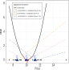
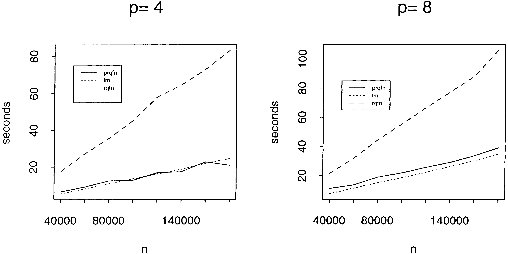

class: title-slide
count: false

```{r setup, include=FALSE}
options(htmltools.dir.version = FALSE)
knitr::opts_chunk$set(echo = FALSE, warning = FALSE, message = FALSE,
                      fig.align = "center", out.width = "80%", fig.path = "images/",
                      eval = TRUE)
library(knitr)
library(kableExtra)
library(ggplot2)
library(ggthemes)
theme_set(theme_few())
library(qrnn)
library(tidyr)
library(appraiseR)
library(quantreg)
library(broom)
library(cowplot)
library(rlist)
library(tibble)
library(mosaic)
tol <- .Machine$double.eps^(2/3)
```

.pull-left[
]

.pull-right[
<br><br><br><br>
### ANÁLISE DE MODELOS DE REGRESSÃO QUANTÍLICA OBTIDOS A PARTIR DE DADOS IMOBILIÁRIOS

#### Autores:

* Carlos Augusto Zilli
* Murilo Damian Ribeiro
* Luiz Fernando Palin Droubi
* Norberto Hochheim
]


---
class: primary, center, middle
count: false

# Motivação

---
class: center, middle
background-image: url("https://statisticaloddsandends.files.wordpress.com/2019/01/growth-chart.jpg")
background-size: contain


---
class: primary

# Histórico

* Boscovich (1760): propôs o seguinte problema
  
  Encontrar $\hat{\alpha}$ e $\hat{\beta}$ tal que:
  
  $$y_i = \hat{\alpha} + \hat{\beta}x_i + \hat{u}_i$$
    Com $\sum \hat u_i = 0$ e $\sum |\hat u_i| = \text{min}!$
--

* Laplace(1789): resolveu matematicamente o problema proposto.
--

* Legendre(1805): Nouvelles méthodes pour la determination des orbites des comètes. Primeira introduão do método dos mínimos quadrados

* Gauss (1809): Theoria Motus Corporum Coelestium. Ligou MQO à distribuição normal.
--

* Edgeworth (1887): propõe algorítmo para obter intercepto e inclinação da reta, descartando a restrição $\sum \hat u_i = 0$.
--

* Década de 40: Algoritmos Simplex
--

* Arrow e Hoffenberg (1959): aplicação da regressão à mediana em Economia.
--

* Koenker e Basset (1978): Regressão Quantílica

---
class: primary

# Estimativas amostrais

```{r}
data.frame(Estimativa = c("Média", "Mediana", "Quantil"),
           `Expressão` = c("\\(\\min_{\\mu \\in \\mathfrak{R}} \\sum (y_i - \\mu)^2\\)",
                           "\\(\\min_{\\xi \\in \\mathfrak{R}} \\sum|y_i - \\xi|\\)",
                           "\\(\\min_{\\xi \\in \\mathfrak{R}} \\sum \\rho_\\tau (y_i - \\xi)\\)")
           ) %>%
  knitr::kable(format = "html", escape = FALSE)
```

---
class: primary

## Função de perda ou de custo

.center2[

]

---
class: primary

## Funções para quantis variados

```{r quantis, fig.height=3.5, dev='svg'}
x <- seq(-2, 2, length=200)
`.1` <- tilted.abs(x, tau=0.1)
`.25` <- tilted.abs(x, tau=0.25)
`.5` <- tilted.abs(x, tau=0.5)
`.75` <- tilted.abs(x, tau=0.75)
`.9` <- tilted.abs(x, tau=0.9)
dados <- as.data.frame(cbind(x, `.1`, `.25`, `.5`, `.75`, `.9`))
dados <- gather(dados, "tau", y, -x)
ggplot(dados, aes(x = x, y = y, colour = tau)) + 
  geom_line() +
  ylab(bquote(rho[tau] ~ (epsilon))) +
  xlab(bquote(epsilon)) +
  guides(colour=guide_legend(title=bquote(tau)))
```

---
class: primary
background-image: url(Quantis.svg)
backgorund-size: contain

```{r}
# dat <- tibble::tibble(Valor = Cars93$Price[which(Cars93$Type == "Small")], 
#                       Quadratic = (Valor - mean(Valor))^2, 
#                       `.25` = tilted.abs(Valor, tau = .25),
#                       Median = abs(Valor - median(Valor)),
#                       `.75` = tilted.abs(Valor, tau = .75))
# dat <- reshape2::melt(dat, id = 1)
# ggplot(dat, aes(x = Valor, y = value, color = variable)) + geom_line() + ylim(0, 8)
# 
```

---
class: primary

## Outras funções de perda 

.center2[

]

---
class: primary

## Regressão Linear vs. Quantílica

#### Regressão Linear

$$\min_{\mu \in \mathfrak{R}^p} \sum  (y_i - \mu(x_i, \beta))^2$$


#### Regressão Quantílica

$$\min_{\xi \in \mathfrak{R}^p } \sum \rho_\tau (y_i - \xi(x_i, \beta))$$
Basicamente:

$$\text{Procura-se} \qquad \hat\beta (\tau) \quad | \quad \text{res} \left\{\begin{matrix}
\tau n > 0\\ 
(1-\tau)n <0
\end{matrix}\right.$$

---
class: primary

### Interpretação geométrica

O problema pode ser abordado geometricamente: constrói-se um vetor dos erros, e 
minimiza-se a norma deste vetor. 

Geometricamente os problemas são similares, porém a norma do vetor é definida de 
forma diferente em cada método.

#### Regressão Linear

No caso da regressão linear, a norma é a euclidiana, ou L2:

$$|| x ||_2 = \sqrt{\left(\sum x_i^2\right)} = \sqrt{x_1^2 + x_2^2 + \ldots + x_i^2} = \sqrt{x^Tx}$$
$$e = \min_{\beta \in \mathfrak{R}^p} \sum  ||y - X\beta)||_2^2$$

#### Regressão Quantílica

No caso da regressão quantílica, a norma é a L1:

$$|| x ||_1 = \sum_i |x_i| = |x_1| + |x_2| + \ldots + |x_i|$$

---
class: primary

## Vantagens e desvantagens

|   | **Mínimos Quadrados Ordinários**  |	**Mínimos Resíduos Absolutos**         |
|:--|:----------------------------------|:---------------------------------------|
|1  | Não muito robusto                 | Robusto                                |
|2  | Solução Estável	                  | Solução instável e iterativa           |
|3  | Solução Única     	              | Possíveis múltiplas soluções           |
|4  | Problema da retransformação       | Invariante a transformações monotônicas|
|5  | Eficiência Computacional          | Ineficiência computacional relativa    |
|6  | MLE Distribuição Normal           | MLE Distribuição de Laplace            | 

---
class: primary

## 1. Robustez

.center2[

]

---
class: primary

## Cuidado!

.center2[

]

---
class: primary

## 2. Estabilidade da Solução

.center2[

]


---
class: primary

## 3. Unicidade da Solução

.center2[

]

---
class: primary

### 3.1 Média: solução única e analítica

Se os regressores forem linearmente independentes, a solução existe e é única!

--

$$MSE = \sum \frac{1}{n}(y_i - c)^2 \\
\arg \min_c MSE \rightarrow c = \mu \\
\frac{\partial MSE}{\partial c} = 0 \\
\frac{\partial MSE}{\partial c} = \frac{1}{n} \frac{\partial \sum (y_i - c)^2}{\partial c} = 0 \\
\frac{\partial MSE}{\partial c} = \frac{1}{n} \sum (-2y_i + 2c) = 0 \\
c = \frac{1}{n} \sum y_i = \mu$$
--

Este resultado pode ser generalizado para $\mathfrak{R}^p$.

---
class: primary

### 3.2 Mediana: Solução não-única com dados inventados

```{r exemplo_1, fig.height=3.5, dev ='svg', fig.cap='Fonte: https://tinyurl.com/y6283end', results='hide'}
par(bg = "light blue")
x <- rep(1:10, each=2)
y <- x/10 + 0:1
plot(x,y, pch = 21, bg = 'grey', main = 'Dados Inventados')

sad <- function(x,y,coef) { # mad is sad/n
    yhat <- coef[1] + coef[2]*x
    resid <- y - yhat
    sum( abs( resid ) )
}
fit <- lm(y~x)
abline(fit, col = "red", lwd = 2)

fit0 <- rq(y~x)
abline(fit0)

fit1 <- lm( y~x, subset= c(1,20) )
fit2 <- lm( y~x, subset= c(2,19) )
fit3 <- lm( y~x, subset= c(2,20) )
fit4 <- lm( y~x, subset= c(1,19) )

fit5.coef <- c(0.5, 1/10)

abline(fit1)
abline(fit2)
abline(fit3)
abline(fit4)
abline(fit5.coef)
for (i in seq( -0.5, 0.5, by=0.1 ) ) {
    abline( fit5.coef + c(i,0) )
}

tmp1 <- seq( coef(fit1)[1], coef(fit2)[1], len=10 )
tmp2 <- seq( coef(fit1)[2], coef(fit2)[2], len=10 )

for (i in seq_along(tmp1) ) {
    abline( tmp1[i], tmp2[i] )
}

sad(x,y, coef(fit0))
sad(x,y, coef(fit1))
sad(x,y, coef(fit2))
sad(x,y, coef(fit3))
sad(x,y, coef(fit4))
sad(x,y, fit5.coef )

for (i in seq( -0.5, 0.5, by=0.1 ) ) {
    print(sad(x,y, fit5.coef + c(i,0) ))
}

for (i in seq_along(tmp1) ) {
    print(sad(x,y, c(tmp1[i], tmp2[i]) ) )
}
```

---
class: primary

### 3.2 Mediana: Solução não-única com dados aleatórios

```{r exemplo_2, fig.height=3.5, dev ='svg', fig.cap='Fonte: https://tinyurl.com/y6283end', results='hide'}
# Exemplo 2
set.seed(1)
par(bg = "light blue")
y2 <- y + rnorm(20,0,0.25)
plot(x,y2, pch = 21, bg = 'grey', main = 'Dados aleatórios')
fitnew <- rq(y2~x)  # note the still non-unique warning
abline(fitnew)
abline(coef(fitnew) + c(.1,0))
abline(coef(fitnew) + c(0, 0.01) )
sad( x,y2, coef(fitnew) )
sad( x,y2, coef(fitnew)+c(.1,0))
sad( x,y2, coef(fitnew)+c(0,0.01))
```

---
class: primary

## FAQ

1.  [Non-uniqueness of Solutions] "The estimation of regression quantiles is a 
linear programming problem.  And the optimal solution may not be unique. However, 
rq() provides a single solution. My question is what are the additional 
constraints to get the single solution? Because when we do the research, we can 
write our own routine in different software like in SAS to estimate quantile 
regression, does that mean people will get different solutions?"

   From ?rq.fit.fn:

   eps: tolerance parameter for convergence.  In cases of multiple optimal 
   solutions there may be some discrepancy between solutions produced by method 
   '"fn"' and method '"br"'.  This is due to the fact that '"fn"' tends to 
   converge to a point near the centroid of the solution set, while '"br"' stops 
   at a vertex of the set. 

   There is already facility for doing QR in SAS and it is based _very_closely_ 
   on my R package and uses essentially the same algorithms.

2.  [Non-uniqueness redux] "And all these solutions is [sic] correct? Or do we need additional constraints to get the same solutions as derived in R?" 

   Yes, they are all correct.  Just as any number between the two central order 
   statistics is "a median" when the sample size is even and the order statistics 
   are distinct.  The main point here is that the differences between solutions are 
   of order 1/n and the inherent uncertainty about the estimates is of order 1/sqrt(n) so 
   the former variability is essentially irrelevant.
   
---
class: primary

## 4. Transformações

### Regressão linear

Na regressão linear, a média condicional da variável original não é obtida pela 
simples retransformação da variável transformada por sua função inversa, a menos 
que a função de transformação seja linear.

$$E[f(Y)] \neq f(EY)$$
--

### Regressão Quantílica

> Regression quantiles, like the usual 1-sample quantiles with no predictor variables, retain their statistical propertires under any linear or nonlinear monotonic transformation of y as a consequence of this ordering property; that is, they are equivariant under monotonic transformation of y (Koenker and Machado 1999). Thus, it is possible to use a nonlinear transformation (eg logarithmic) of y to estimate linear regression quantiles and then back transform the estimates to the original scale (a nonlinear function) without any loss of information. This, of course, is not true with means, including those from regression models (Cade e Noon, 2003).


$$Q_{f(Y)}(\tau) = f[Q_Y(\tau)]$$

---
class: primary

## RQ - dados originais

```{r qr1, fig.height=3.5, dev='svg'}
dados <- centro_2015@data
dados$padrao <- as.numeric(dados$padrao)
qs <- 1:9/10
qr <- rq(valor ~ area_total, data = dados, tau = qs)
ggplot(dados, aes(area_total, valor)) + 
  geom_point() + 
  geom_quantile(quantiles = qs) + 
  geom_smooth(method="lm", se = FALSE, level = .80, color = "red")
```

---
class: primary

## RQ - dados transformados

```{r qr2, fig.height=3.5, dev='svg'}
qs <- 1:9/10
qr2 <- rq(log(valor) ~ log(area_total), data = dados, tau = qs)
ggplot(dados, aes(log(area_total), log(valor))) + 
  geom_point() + 
  geom_quantile(quantiles = qs) + 
  geom_smooth(method="lm", se = FALSE, color = "red")
```


---
class: primary

## 5. Eficiência Computacional

.center2[

]

---
class: primary

# Comparativo de eficiência computacional

.center2[

]

--

<br><br><br><br><br><br><br><br><br><br><br><br><br><br>

> the message for that Gaussian hare who has been frolicking in the flowers, confident of victory, is clear. Laplace’s old tortoise, despite the house he wears on his back to protect him from inclement statistical weather, has a few new tricks and the race is far from over (Portnoy e Koenker, 1997).

---
class: primary, middle

### 6. Estimador Máxima Verossimilhança

.pull-left[

#### Média

```{r dist_normal, fig.height=3.5, dev='svg'}
xcnorm(0, return = "plot", system = "gg") %>%
  gf_labs(title = "Distribuição Normal")
```

$$\hat \mu = \frac{1}{n}\sum x_i$$
$$\hat \sigma = \frac{1}{n-1} \sum_{i=1}^n (x_i - \hat \mu)^2$$
$$f(x|\mu, \sigma) = \frac{1}{\sigma\sqrt{2/\pi}}\exp \left (-\frac{1}{2}\frac{(x - \mu)^2}{\sigma^2} \right )$$

]

.pull-right[

#### Mediana

```{r dist_Laplace, fig.height=3.5, dev='svg'}
library(LaplacesDemon)
#Plot Probability Functions
x <- seq(from=-5, to=5, by=0.1)
plot(x, dlaplace(x,0,0.5), ylim=c(0,1), type="l", main="Distribuição de Laplace",
     ylab="density", col="red")
lines(x, dlaplace(x,0,1), type="l", col="green")
lines(x, dlaplace(x,0,2), type="l", col="blue")
legend(2, 0.9, expression(paste(mu==0, ", ", lambda==0.5),
     paste(mu==0, ", ", lambda==1), paste(mu==0, ", ", lambda==2)),
     lty=c(1,1,1), col=c("red","green","blue"))
```

$$\hat \mu = \arg\min_c \sum |x_i - c|$$
$$\hat \lambda = \frac{1}{n} \sum_{i=1}^n |x_i - \hat \mu|$$

$$f(x|\mu, \lambda) = \frac{1}{2 \lambda} \exp \left ( -\frac{|x - \mu|}{\lambda}\right )$$
]

---
class: primary, center, middle
count: false

# Regressão Quantílica


---
class:primary

```{r}
fit1 <- rq(valor ~ area_total, data = dados, tau = 0.1)
#h1 <- which(abs(fit1$resid) < tol)
fit_data <- augment(fit1)
# library(gghighlight)
# gghighlight_point(fit_data, aes(x=area_total, y=valor), .resid < 0, col="red") + 
#   geom_quantile(quantile = .1)
p1 <- ggplot(fit_data, aes(x = area_total, y = valor)) +
  geom_quantile(quantiles = 0.1) +
  geom_point(aes(x = area_total, y = valor, colour = .resid > 0)) + 
  labs(title = expression(~tau~'= .1'))
fit2 <- rq(valor ~ area_total, data = centro_2015, tau = 0.2)
fit_data <- augment(fit2)
p2 <- ggplot(fit_data, aes(x = area_total, y = valor)) +
  geom_quantile(quantiles = 0.2) +
  geom_point(aes(x = area_total, y = valor, colour = .resid > 0)) + 
  labs(title = expression(~tau~'= .2'))
fit3 <- rq(valor ~ area_total, data = centro_2015, tau = 0.5)
fit_data <- augment(fit3)
p3 <- ggplot(fit_data, aes(x = area_total, y = valor)) +
  geom_quantile(quantiles = 0.5) +
  geom_point(aes(x = area_total, y = valor, colour = .resid > 0)) + 
  labs(title = expression(~tau~'= .5'))
fit4 <- rq(valor ~ area_total, data = centro_2015, tau = 0.8)
fit_data <- augment(fit4)
p4 <- ggplot(fit_data, aes(x = area_total, y = valor)) +
  geom_quantile(quantiles = 0.8) +
  geom_point(aes(x = area_total, y = valor, colour = .resid > 0)) + 
  labs(title = expression(~tau~'= .8'))
fit5 <- rq(valor ~ area_total, data = centro_2015, tau = 0.9)
fit_data <- augment(fit5)
p5 <- ggplot(fit_data, aes(x = area_total, y = valor)) +
  geom_quantile(quantiles = 0.9) +
  geom_point(aes(x = area_total, y = valor, colour = .resid >= 0)) + 
  labs(title = expression(~tau~'= .9'))
legend_b <- get_legend(
  p1 + 
    guides(color = guide_legend(nrow = 1)) +
    theme(legend.position = "bottom")
)
```

```{r residuos_quantis, fig.height=4.5, dev='svg'}
plot_rows <- plot_grid(p1 + theme(legend.position="none"),
          p2 + theme(legend.position="none"), 
          p3 + theme(legend.position="none"), 
          p4 + theme(legend.position="none"), 
          p5 + theme(legend.position="none"), 
          nrow = 2,
          legend_b)
# now add the title
theme_georgia <- function(...) {
  theme_gray(base_family = "Georgia", ...) + 
    theme(plot.title = element_text(face = "bold"))
}
title <- ggplot() + 
  labs(title = "Regressão para quantis variados", 
       subtitle = "50 dados de apartamentos no centro de Florianópolis (2015)") + 
  theme_georgia()
plot_grid(
  title, plot_rows,
  ncol = 1,
  # rel_heights values control vertical title margins
  rel_heights = c(0.1, 1)
)
```


---
class: primary

## Análise dos coeficientes da RQ

```{r coef1, fig.height=3.5, dev='svg'}
plot(summary(qr), parm="area_total")
```

---
class: primary

## Estimação melhor nos quantis centrais

> Geralmente, a variação amostral aumenta quando o valor de $\tau$ se aproxima de 0 ou 1, mas isto é específico de cada distribuição amostral, modelo, tamanho da amostra e número de parâmetros. Estimações longe do centro da distribuição - a mediana ou o 50º percentil - usualmente não pode ser feita tão precisa.

---
class: primary

## Heteroscedasticidade e não-normalidade

.center2[

]

---
class: primary

## Outras distribuições de erros

```{r lognormal_error, fig.height=3.5, dev = "svg", fig.cap = "Adaptado de Cade e Noon (2003)."}
set.seed(5)
x <- runif(90, 0, 100)
epsilon <- rlnorm(90, 0, 0.75)
y <- 6 + .05*x + epsilon
fit <- lm(y~x)
fit1 <- rq(y~x, tau = .10)
fit2 <- rq(y~x, tau = .25)
fit3 <- rq(y~x, tau = .50)
fit4 <- rq(y~x, tau = .75)
fit5 <- rq(y~x, tau = .90)
par(mar=c(5,4,2,6), bg = "light blue")
plot(y~x, pch = 19, main = "Distribuição de erros lognormal.")
abline(fit, lty = 2)
abline(fit1, col = "yellow")
abline(fit2, col = "red")
abline(fit3, col = "green")
abline(fit4, col = "blue")
abline(fit5, col = "darkred")
legend('topleft', xpd = TRUE, inset=c(1,0), bty = "n",
       legend=c(".10", ".25", ".50", ".75", ".90"),
       col=c("yellow", "red", "green", "blue", "darkred"), lty = 1,
       title= expression(~tau), text.font=4, bg='lightblue')
```


---
class: primary

## Erros lognormais - coeficientes.

```{r lognormal_coefs, fig.height=3.5, fig.show='hold', dev = "svg", fig.cap = "Adaptado de Cade e Noon (2003)."}
par(mfrow = c(1, 2), bg = "light blue")
qs <- seq(0.025, .975, .025)
fit <- rq(y~x, tau = qs)
s <- summary(fit)
x_graph <- seq(.05, .975, .025)
sfun0 <- stepfun(x = x_graph, y = fit$coefficients[1, ], f = 0)
plot(sfun0, xlim = c(0, 1), ylim = c(-5, 25), xaxs="i", yaxs="i", 
     main = "Intercepto por quantis", xlab = "Quantis", ylab = "Intercepto",
     do.points = FALSE, col = "red", lwd = 2)
sfun1 <- stepfun(x = x_graph, y = fit$coefficients[2, ], f = 0)
plot(sfun1, xlim = c(0, 1), ylim = c(-0.05, 0.3), xaxs="i", yaxs="i", 
     main = "Inclinação por quantis", xlab = "Quantis", ylab = "Inclinação",
     do.points = FALSE, col = "red", lwd = 2)
```

---
class: primary

## Erros normais heteroscedásticos

```{r lognormal_het_error, fig.height=3.5, dev = "svg", fig.cap = "Adaptado de Cade e Noon (2003)."}
set.seed(1)
x <- runif(90, 0, 100)
epsilon <- rnorm(90, 0, 1+.05*x)
y <- 6 + .1*x + epsilon
fit <- lm(y~x)
fit1 <- rq(y~x, tau = .10)
fit2 <- rq(y~x, tau = .25)
fit3 <- rq(y~x, tau = .50)
fit4 <- rq(y~x, tau = .75)
fit5 <- rq(y~x, tau = .90)
par(mar=c(5,4,2,6), bg = "light blue")
plot(y~x, pch = 19, main = "Distribuição de erros normal.")
abline(fit, lty = 2)
abline(fit1, col = "yellow")
abline(fit2, col = "red")
abline(fit3, col = "green")
abline(fit4, col = "blue")
abline(fit5, col = "darkred")
legend('topleft', xpd = TRUE, inset=c(1,0), bty = "n",
       legend=c(".10", ".25", ".50", ".75", ".90"),
       col=c("yellow", "red", "green", "blue", "darkred"), lty = 1,
       title= expression(~tau), text.font=4, bg='lightblue')
```

---
class: primary

## Erros normais heteroscedásticos - coeficientes

```{r}
qs <- seq(0.025, .975, .025)
fit <- rq(y~x, tau = qs)
s <- summary(fit)
a <- list.select(s, coefficients, tau) %>% list.rbind()
a <- as_tibble(a)
```


```{r normal_het_coefs, fig.height=3.5, fig.show='hold', dev = "svg", fig.cap = "Adaptado de Cade e Noon (2003)."}
par(mfrow = c(1, 2), bg = "light blue")
x_graph <- seq(.05, .975, .025)
sfun0 <- stepfun(x = x_graph, y = fit$coefficients[1, ], f = 0)
plot(sfun0, xlim = c(0, 1), ylim = c(-5, 25), xaxs="i", yaxs="i", 
     main = "Intercepto por quantis", xlab = "Quantis", ylab = "Intercepto",
     do.points = FALSE, col = "red", lwd = 2)
sfun1 <- stepfun(x = x_graph, y = fit$coefficients[2, ], f = 0)
plot(sfun1, xlim = c(0, 1), ylim = c(-0.05, 0.3), xaxs="i", yaxs="i", 
     main = "Inclinação por quantis", xlab = "Quantis", ylab = "Inclinação",
     do.points = FALSE, col = "red", lwd = 2)
```

---
class: primary, center, middle
count: false

## Estudo de Caso

### RQ *vs.* OLS em $p$ dimensões

---
class: center, middle

```{r}
fit <- lm(log(valor) ~ area_total + quartos + suites + garagens + 
            log(dist_b_mar) + rec(padrao), data = dados,
          subset = -c(31, 39))
fit_1 <- rq(log(valor) ~ area_total + quartos + suites + garagens + 
            log(dist_b_mar) + rec(padrao), data = dados)
fit_2 <- rq(log(valor) ~ area_total + quartos + suites + garagens +
            log(dist_b_mar) + rec(padrao), data = dados, tau = .1)
fit_3 <- rq(log(valor) ~ area_total + quartos + suites + garagens +
            log(dist_b_mar) + rec(padrao), data = dados, tau = .9)
qs <- 1:9/10
fit_qr <- rq(log(valor) ~ area_total + quartos + suites + garagens + 
            log(dist_b_mar) + rec(padrao), data = dados, tau = qs)
```

```{r coefs, fig.height=5.5, dev='svg'}
plot(summary(fit_qr))
```

---
class: primary

## Predições

Foram ajustados dois modelos para dados 50 de apartamentos em Florianópolis do 
ano de 2015.

Para a regressão quantílica, foi utilizado todo o conjunto de dados.

Para a regressão linear, o conjunto de dados foi saneado e foram efetivamente
utilizados 48 dados (-4%).

--

```{r}
p <- predict(fit, newdata = dados[52,], interval = "confidence", level = .80)
pp <- predict(fit, newdata = dados[52,], interval = "prediction", level = .80)
p1 <- predict(fit_1, newdata = dados[52,], interval = "confidence", level = .80)
p2 <- predict(fit_2, newdata = dados[52,], interval = "confidence", level = .80)
p3 <- predict(fit_3, newdata = dados[52,], interval = "confidence", level = .80)
P <- brformat(exp(p))
PP <- brformat(exp(pp))
P1 <- brformat(exp(p1))
P2 <- brformat(exp(p2))
P3 <- brformat(exp(p3))
amp_ols <- brformat(amplitude(exp(p)))
amp_rq <- brformat(amplitude(exp(p1)))
```

|   Método             | 10% / IP      |       IC inferior |  Estimativa Central |  IC Superior      | 90% / IP      | Amplitude IC |
|:---------------------|--------------:|------------------:|--------------------:|------------------:|--------------:|-------------:|
| Regressão linear     |`r PP[, "lwr"]`| `r P[, "lwr"]`    | `r PP[, "fit"]`     | `r P[, "upr"]`    |`r PP[, "upr"]`| `r amp_ols`% |      
| Regressão quantílica |`r P2[, "fit"]`| `r P1[, "lower"]` | `r P1[, "fit"]`     | `r P1[, "higher"]`|`r P3[, "fit"]`| `r amp_rq`%  |

--

A maior amplitude do IC para a RQ confirma a menor eficiência prevista pela teoria.

> The sample median is a statistically consistent estimator of $\mu$, but it is 
only $2/\pi$ as efficient as the sample mean.

Ou seja, assumindo que a distribuição dos dados é normal, onde média e mediana
coincidem, são necessários aproximadamente 57% mais dados para a regressão à mediana
obter a mesma precisão que a regressão linear.

---
class: primary, center, middle

# Obrigado!


